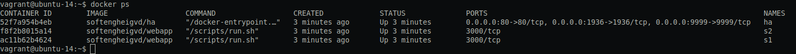
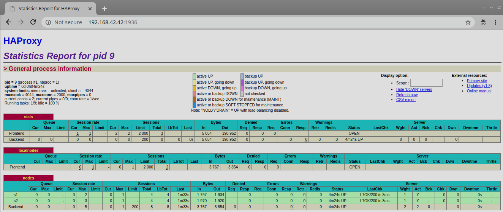
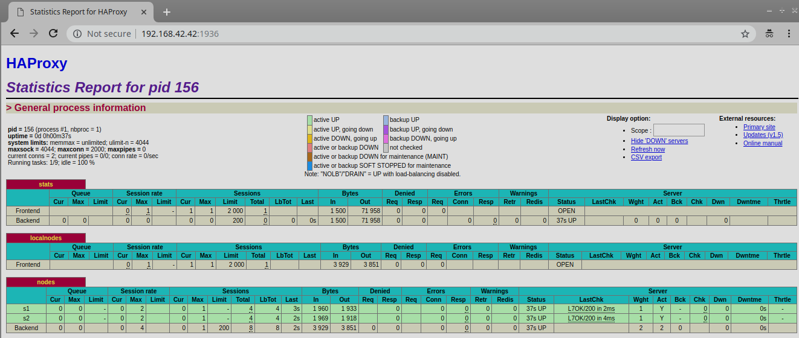
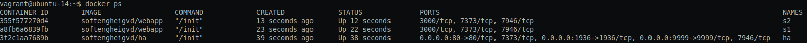
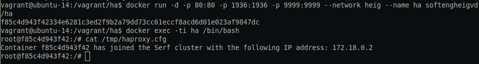

title: Lab 04 - Docker

----

Iando Rafidimalala & Antoine Nourazar


## 1. Introduction
The purpose of this lab is how to deploy a load-balancing infrastructure through the docker technology. This lab is based on the previous lab environment. This lab is divided 6 steps. Through these steps, this lab allows us to understand the core concepts for dynamic scaling of an application in production and put in practice the decentralized management of web server instances.

## 2. task 0: Identify issues and install the tools
### 2.1 Identify issues
1. **[M1]** Do you think we can use the current solution for a production environment? What are the main problems when deploying it in a production environment?

This current solution is hard to maintain. Each modification have to do manually. When the infrastructure will grow up, the troubleshouting is more Difficulte to handle. Each modification such add servers, set up the load-balancing policy implies to reload this configuration and reboot all the infrastructure.

2. **[M2]** Describe what you need to do to add new webapp container to the infrastructure. Give the exact steps of what you have to do without modifiying the way the things are done. Hint: You probably have to modify some configuration and script files in a Docker image.

Adding a new server implies few steps. HAProxy have to check out the new server through ha/config/haproxy.cfg.
  1. Define a new backend node in the HA configuration that extend the server pool
    ```bash
          server s3 <s3>:3000 check
    ```

  2. Add this line in the ha/scripts/run.sh file:
    ```bash
          sed -i 's/<s3>/$S3_PORT_3000_TCP_ADDR/g' /usr/local/etc/haproxy/haproxy.cfg
    ```
  3. Built the new container adding this line in the script start-container.sh:

    ```bash
          docker run -d --name s3 softengheigvd/webapp
    ```
This modification affect the docker container. We can re-built the image and run the container.
  4. Rebuilt the HA image
  ```bash
        docker run -d --name s3 softengheigvd/webapp
  ```
  5. Run the HA container
  ```bash
        docker run -d -p 80:80 -p 1936:1936 -p 9999:9999 --link s1 --link s2 --link s3 --name ha softengheigvd/ha
  ```

3. **[M3]** Based on your previous answers, you have detected some issues in the current solution. Now propose a better approach at a high level.

Modify manually the configuration is painful. Adding/removing a new server in this infrastructure needs more steps which the admnistrator has to manage. Dynamic configuration approach overcome this issue.

4. **[M4]** You probably noticed that the list of web application nodes is hardcoded in the load balancer configuration. How can we manage the web app nodes in a more dynamic fashion?

We should use a tool such a script or an application to manage the web app nodes in a dynamic fashion. According this approach, we can use Serf which is cluster membership management tool. Serf has a feature to discovering the web servers and automatically adding them to a load balancer. Using Serf, it is trivial to create a Serf cluster consisting of web servers and load balancers. The load balancers can listen for membership changes and when a web server comes online or goes offline, they can update their node list.

5. **[M5]** In the physical or virtual machines of a typical infrastructure we tend to have not only one main process (like the web server or the load balancer) running, but a few additional processes on the side to perform management tasks.

Docker containers are designed to run only one main process which means the process ends then the containers stops. To overcome this limitation, we will use a process supervisor, S6, which allows more than one process running in parallel in docker.

6. **[M6]** In our current solution, although the load balancer configuration is changing dynamically, it doesn't follow dynamically the configuration of our distributed system when web servers are added or removed. If we take a closer look at the run.sh script, we see two calls to sed which will replace two lines in the haproxy.cfg configuration file just before we start haproxy. You clearly see that the configuration file has two lines and the script will replace these two lines.

In this current solution, adding more web server nodes could not work as expected. As the load balancing configuration is hardcoded, a human has to intervene to make up this update because every modification, add/remove nodes, does not appear in the HA configuration. It's not really dynamic. A template engine can be helpful to generate the configuration.


### 2.2 install the tools
Thanks to the previous lab, we already set up that we need.  


**Deliverables:**
1. A screenshot of the stats page of HAProxy at http://192.168.42.42:1936. You should see your backend nodes.



2. This is the URL of our repository URL in the lab report.
https://github.com/Mantha32/Teaching-HEIGVD-AIT-2016-Labo-Docker

## 3. Task 1: Add a process supervisor to run several processes
**Deliverables:**
1. **Take a screenshot of the stats page of HAProxy at http://192.168.42.42:1936. You should see your backend nodes. It should be really similar to the screenshot of the previous task.**


2. **Describe your difficulties for this task and your understanding of what is happening during this task. Explain in your own words why are we installing a process supervisor. Do not hesitate to do more research and to find more articles on that topic to illustrate the problem.**

According the set up processing describes in the lab, we don't have any problem.

## 4. Task 2: Add a tool to manage membership in the web server cluster
**Deliverables:**
1. **Provide the docker log output for each of the containers: ha, s1 and s2.**

The HA is launched at first.

The logs are available under these links:<br/>
[ha](../logs/task2/HA_startFirst/ha.log)<br/>
[s1](../logs/task2/HA_startFirst/s1.log)<br/>
[s2](../logs/task2/HA_startFirst/s2.log)<br/>

2. **Give the answer to the question about the existing problem with the current solution.**

Due to the procedure describing in this labo, we launch ha then s1 and s2. Ha create un cluster and join himself on this cluster and the s1 ans s2 join the cluster though ha. If ha leaves the cluster, all the other nodes can not join the cluster anymore.
The logs about his experience are available under these links:<br/>
[s1](../logs/task2/Remove_Add_Nodes/s1.log)<br/>
[s2](../logs/task2/Remove_Add_Nodes/s2.log)<br/>

If we reverse the launching order such we start the node s1 and s2 before ha. The child nodes will not be linked to it.

3. **Give an explanation on how Serf is working. Read the official website to get more details about the GOSSIP protocol used in Serf. Try to find other solutions that can be used to solve similar situations where we need some auto-discovery mechanism.**

Serf is a decentralized cluster membership management tool.
Serf uses a gossip protocol based on SWIM so that all nodes can communicate with each other and stores all nodes in one cluster. Thanks to this protocol, the serf agent send broadcast messages between the nodes in the cluster. Each node can notify the others about his state thanks to the event (leaving or joining the cluster). New nodes in an existing cluster must be given the address of at least one existing member in order to join the cluster. The new member does a full state sync with the existing member over TCP and begins gossiping its existence to the cluster.  
For running an application in a computer farm, [hadoop](https://hadoop.apache.org/),a suitable for scalability and distributed computing, seems a good alternative.

reference: https://www.serf.io/docs/internals/gossip.html

## 5. Task 3: React to membership changes
1. **Provide the docker log output for each of the containers: ha, s1 and s2.** </br>
[Ha only](../logs/task3/haFirst.log)<br/>
[s1](../logs/task3/s1.log)<br/>
[Ha before s1](../logs/task3/haBeforeS1Run.log)<br/>
[s2](../logs/task3/s2.log)<br/>

2. **Provide the logs from the ha container gathered directly from the /var/log/serf.log file present in the container.** </br>
[/var/log/serf.log](../logs/task3/serf.log)<br/>

## 6. Task 4: Use a template engine to easily generate configuration files

Configure haproxy.cfg.hb not yet done

how to copy log in the vagrnat machines
scp -P 2222 vagrant@127.0.0.1:/home/vagrant/ha* ./logs/task3/

The content of the haproxy in the ha container



**Deliverables:**
1. **You probably noticed when we added xz-utils, we have to rebuild the whole image which took some time. What can we do to mitigate that? Take a look at the Docker documentation on image layers. Tell us about the pros and cons to merge as much as possible of the command. In other words, compare:**</br>
```
RUN command 1
RUN command 2
RUN command 3
```

vs.

```
RUN command 1 && command 2 && command 3
```
Docker image reminds an onion with OS distribution inside and a number of layers on top of it. RUN instruction allows to install your application and packages requited for it. It executes any commands on top of the current image and creates a new layer by committing the results. In the first way to build image, with this multiple RUN instructions, 3 layers are added on top of the base image. Regarding to rebuild the image, each layer is cached. When an image is re-built, it could be faster because no need to download all packages. However, with a single RUN instructions, a single layer is added. Besides, if the first command in the RUN instruction  is failed ,then the remain commands can't be executed. Note that apt-get update and apt-get install are executed in a single RUN instruction. This is done to make sure that the latest packages will be installed. If apt-get install were in a separate RUN instruction, then it would reuse a layer added by apt-get update, which could had been created a long time ago.</br>

Squashing image with *docker-squash* can reduce image sizes significantly. *docker-squash* is a utility to squash multiple docker layers into one in order to create an image with fewer and smaller layers. It retains Dockerfile commands such as PORT, ENV, etc.. so that squashed images work the same as they were originally built. In addition, deleted files in later layers are actually purged from the image when squashed.

2. **Propose a different approach to architecture our images to be able to reuse as much as possible what we have done. Your proposition should also try to avoid as much as possible repetitions between your images.**</br>
Docker has caching layer system on purpose to reuse those layer. The order instruction effect the layer order. if you have a core set of instructions that you use across all of your images (like a MAINTAINER value you always use), it's best to keep those at the top of your Dockerfile and always in the same order. That way those cached layers can be shared between different images.

3. **Provide the /tmp/haproxy.cfg file generated in the ha container after each step. Place the output into the logs folder like you already did for the Docker logs in the previous tasks. Three files are expected.**</br>
[haproxy](../logs/task4/haproxy.cfg.log)</br>
[haproxy after running s1](../logs/task4/haproxyAfterRunningS1.cfg.log)</br>
[haproxy after running s2](../logs/task4/haproxyAfterRunningS2.cfg.log)</br>
[docker  inspect ha](../logs/task4/dockerInspectHA.log)</br>
[docker  inspect s1](../logs/task4/dockerInspectS1.log)</br>
[docker  inspect s2](../logs/task4/dockerInspectS2.log)</br>
[docker  ps](../logs/task4/docker_ps.log)</br>

4. **Based on the three output files you have collected, what can you say about the way we generate it? What is the problem if any?**</br>
The configuration file /tmp/haproxy.cfg is a temporary file that contain only the last container has joined the cluster. This file is override when an event occures.

## 7. Task 5: Generate a new load balancer configuration when membership changes

## 8. Task 6: Make the load balancer automatically reload the new configuration

## 9. Difficulties

## 10. Conclusion
